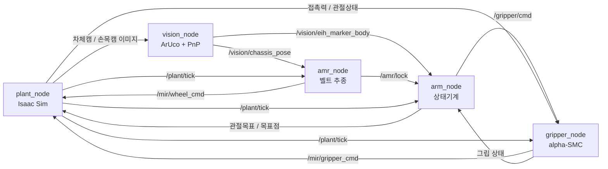

# IsaacSim_ranger_piper — Ranger Mini + PiPER 이동 중 Pick & Place 시뮬레이션

회전하는 벨트 위를 지나가는 물체를 AMR이 따라가며 로봇팔로 집고, 선반에 내려놓는 ROS 2 워크스페이스.
Isaac Sim 안에서 전체 시퀀스를 돌린다. 실기 구동은 별도 저장소 `piper_ws`에서 관리한다.

- **로봇** AgileX Ranger Mini v2 (4WIS) + PiPER 6축 + 2지 그리퍼
- **센서** 차체 카메라 + 손목 카메라(RealSense D455 모델, eye-in-hand)
- **환경** Isaac Sim 6.0.1 / ROS 2 Jazzy
- **동작** 벨트 속도 추정 → 물체 추종·락 → 손목캠 마커 검출 → 접근 → 파지 → 리프트 → 파지 검증 → 선반 도킹 → 배치

물체에는 ArUco 마커가 붙어 있고, 주변에 마커 없는 디코이를 같이 흘려 진짜 타겟만 골라 집는지 검증한다.

---

## 노드 구성과 데이터 흐름



| 노드 | 패키지 | 역할 |
|---|---|---|
| `plant_node` | `plant_pkg` | Isaac Sim 씬(벨트·물체·로봇·카메라) 구동, IK와 관절 구동, 센서값 발행 |
| `vision_node` | `vision_pkg` | ArUco 검출 → solvePnP → 게이트 → 차체/손목 기준 좌표 발행 |
| `amr_node` | `control_pkg` | 벨트 속도 추정과 속도매칭 추종, 락 신호, 선반 도킹 |
| `arm_node` | `control_pkg` | phase 상태기계 — 팔 시퀀스를 지휘한다 |
| `gripper_node` | `hardware_pkg` | 그리퍼 힘제어 (α-SMC), 접촉 판정 |

모든 노드는 `plant_node`가 내보내는 `/plant/tick`에 맞춰 한 스텝씩 진행한다.
공통 상수와 메시지 pack/unpack 함수는 `common_pkg/step22_common.py`에 모여 있다.

---

## 사전 준비

- Isaac Sim이 `~/isaacsim`에 설치돼 있어야 한다. `plant_node`는 Isaac Sim 번들 `python.sh` 위에서만
  돌기 때문에, `ros2 run`으로 띄우면 런처(`plant_launcher.py`)가 `/home/da/isaacsim/python.sh`로 넘겨 실행한다.
  경로가 다르면 `plant_launcher.py`의 `ISAACSIM_DIR`를 고친다.
- 로봇 에셋(USD/URDF)은 저장소에 들어 있지 않다. `plant_node.py`가 `~/projects/ranger_piper` 아래에서 읽는다.

  | 에셋 | 경로 |
  |---|---|
  | Ranger Mini USD | `ranger_mini/usd/ranger_mini_v2/ranger_mini_v2.usda` |
  | PiPER USD | `_src/piper_isaac_sim/USD/piper_v2.usd` |
  | PiPER URDF / Lula 설정 | `piper/urdf/piper_description.urdf`, `piper_robot_description.yaml` |

- `meshes/`(Ranger Mini 벤더 메시)는 GitHub 용량 제한 때문에 추적하지 않는다.

## 빌드

```bash
git clone https://github.com/DH-LDH/IsaacSim_ranger_piper.git ~/isaacsim/ros2_ws_ranger_piper
cd ~/isaacsim/ros2_ws_ranger_piper
source /opt/ros/jazzy/setup.bash
colcon build --symlink-install
source install/setup.bash
```

`colcon build`는 반드시 이 워크스페이스 폴더 안에서 실행한다 (`~/isaacsim` 루트에서 하면 Isaac Sim 폴더에 `build/`가 생긴다).

## 실행

터미널을 나눠 `plant_node`를 먼저 띄우고, 씬이 올라온 뒤 나머지 노드를 띄운다.

```bash
ros2 run plant_pkg plant_node            # GUI로 관찰
ros2 run plant_pkg plant_node --headless # 창 없이
```

```bash
ros2 run vision_pkg vision_node
ros2 run control_pkg amr_node
ros2 run control_pkg arm_node
ros2 run hardware_pkg gripper_node
```

### plant_node 인자

| 인자 | 기본값 | 의미 |
|---|---|---|
| `--headless` | 꺼짐 | 창 없이 실행 |
| `--max-sec` | `36000` | 이 시간이 지나면 자동 종료 [s] |
| `--keep-open` | 꺼짐 | 시퀀스가 끝나도 창을 닫지 않음 |

시행 결과는 `~/projects/ranger_piper/step22_nodes/results.csv`, 포즈 기록은 같은 폴더의 `pose_log.csv`에 쌓인다.

### arm_node 파라미터

`--ros-args -p 이름:=값`으로 준다. 자주 쓰는 것만 추렸다.

| 파라미터 | 의미 |
|---|---|
| `step_confirm` | 단계마다 멈추고 `/arm/step_confirm` 승인을 기다림 |
| `approach_dist` | 파지점 위 pre-grip 대기 높이 [m] |
| `grasp_depth_extra` | 마커 평면보다 더 내려가는 깊이 [m] |
| `ee_grip_offset` | link6 원점 → 그리퍼 끝단 거리 [m] |

---

## 보조 도구

| 스크립트 | 용도 |
|---|---|
| `step_confirm.py` | `step_confirm` 모드에서 Enter로 단계 진행 승인 |
| `set_arm_joint.py` | `plant_node`만 띄운 상태에서 팔을 지정 관절각(도)으로 보냄 — 손목캠 시야 확인용 |

## 태그

| 태그 | 내용 |
|---|---|
| `sim-final` | 시뮬레이션 코드 마지막 상태 |
